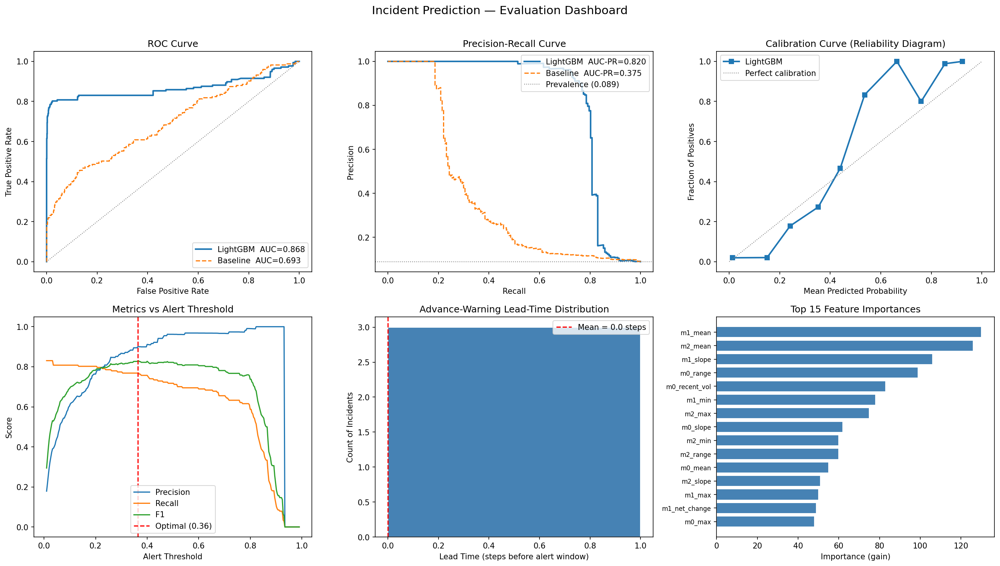

# Incident Prediction — Sliding-Window + LightGBM

Binary classifier that predicts whether an incident will occur within the next **H** time steps, given the previous **W** steps of one or more time-series metrics.

---

## Problem Formulation

Given a multivariate time series of system metrics $\mathbf{x}_1, \ldots, \mathbf{x}_T \in \mathbb{R}^M$ and a binary incident signal $l_t \in \{0, 1\}$, the goal is to learn a function

$$f\!\left(\mathbf{x}_{t-W}, \ldots, \mathbf{x}_{t-1}\right) \;\to\; \hat{y}_t \in \{0, 1\}$$

where $\hat{y}_t = 1$ means "at least one incident is predicted in $[t,\, t+H)$".

A **sliding window** of length $W$ is moved one step at a time across the series. At each position the window is labelled **1** if any incident label fires anywhere in the next $H$ steps, and **0** otherwise — turning the forecasting problem into standard binary classification.

The parameter $H$ directly controls the **advance warning time**: with $H = 10$ the model alerts 10 steps before the incident begins, giving operators time to act.

---

## Dataset

A synthetic multivariate time series is generated programmatically ([src/data_generation.py](src/data_generation.py)):

- **3 metric channels**, each a superposition of two sine waves at different frequencies plus Gaussian noise, providing a realistic periodic baseline.
- **Incidents** are injected as isolated bursts: during an incident window a random subset of metrics receives an additive half-normal spike, simulating a sudden resource exhaustion or error-rate surge.
- Default parameters: 10 000 time steps, ~5 % incident rate, 50-step incident duration.

Using synthetic data ensures full reproducibility and lets us precisely control the signal-to-noise ratio to stress-test the model.

---

## Model — LightGBM

**Why LightGBM?**

| Criterion | Rationale |
|-----------|-----------|
| Tabular features | Gradient boosting excels on hand-crafted statistical features |
| Class imbalance | Native `scale_pos_weight` parameter handles rare incidents |
| Speed | Fast training enables quick iteration over window sizes |
| Interpretability | Feature importances (gain-based) are easy to communicate to operators |
| Production-readiness | Lightweight, no GPU required, simple to serve and retrain |

An LSTM or Transformer would be a natural next step if raw sequences were fed directly; LightGBM is preferred here because the feature engineering already captures the relevant temporal structure.

---

## Feature Engineering

For each metric channel within the look-back window, **9 statistics** are extracted:

| Feature | Description |
|---------|-------------|
| `mean` | Average level |
| `std` | Overall volatility |
| `min` / `max` | Extremes |
| `range` | max − min |
| `net_change` | last − first value |
| `dev_from_mean` | last − mean (recent drift) |
| `slope` | Linear-regression slope (trend direction) |
| `recent_vol` | std of last W/4 steps (short-term instability) |

With 3 metrics this yields a **27-dimensional** feature vector per sample.

---

## Evaluation Setup

### Data split
The dataset is split **chronologically** (no shuffling) to prevent data leakage from future observations into the training set:

```
Train 60 % │ Validation 20 % │ Test 20 %
────────────────────────────────────────→ time
```

Early stopping is applied on the validation set; final metrics are reported on the held-out **test set only**.

### Walk-forward cross-validation
In addition to the single split, **expanding-window (walk-forward) CV** is run with 5 folds to get a robust, variance-aware estimate of generalisation performance:

```
Fold 1:  [====train====|--val--]
Fold 2:  [=======train========|--val--]
Fold 3:  [============train===========|--val--]
...                                           → time
```

### Metrics

| Metric | Why it matters |
|--------|----------------|
| **AUC-ROC** | Threshold-independent measure of discriminative power |
| **AUC-PR** | More informative than AUC-ROC under class imbalance |
| **F1 @ optimal threshold** | Harmonic mean of precision and recall |
| **Calibration curve** | Verifies that probabilities are meaningful (not just rankings) |
| **Lead-time distribution** | Shows how many steps before the alert window the model fires |

### Baseline
A **z-score statistical detector** is used as a baseline: for each window it computes the maximum normalised deviation from the window mean across all metric channels.  This represents the simplest non-trivial alerting rule (i.e., a fixed threshold on a rolling z-score), against which the LightGBM model is compared.

### Alert threshold
The default operating point is the threshold that maximises F1 on the test set. The **threshold sweep panel** in the evaluation dashboard shows how precision, recall, and F1 change across all thresholds so an operator can choose a different operating point based on their SLA:

- **Lower threshold** → higher recall (fewer missed incidents), more false alarms.
- **Higher threshold** → fewer false alarms, higher miss rate.

---

## Results

All numbers below are from a single run with default parameters (`W=50`, `H=10`, `n_samples=10 000`, `seed=42`).

### Walk-forward cross-validation (5 folds)

| Metric | Mean ± Std |
|--------|-----------|
| AUC-ROC | **0.9178 ± 0.0277** |
| AUC-PR | **0.7695 ± 0.0328** |
| F1 | **0.7752 ± 0.0565** |

### Test-set evaluation

| Metric | LightGBM | Z-score baseline | Δ |
|--------|----------|-----------------|---|
| AUC-ROC | **0.8676** | 0.6932 | +0.1744 |
| AUC-PR | **0.8196** | 0.3751 | +0.4445 |
| F1 (optimal threshold) | **0.8293** | — | — |

**Classification report at threshold = 0.364:**

```
              precision    recall    f1-score   support

 No Incident     0.98       0.99       0.98      1812
    Incident     0.90       0.77       0.83       177

    accuracy                           0.97      1989
```

**Confusion matrix:** TN=1797  FP=15  FN=41  TP=136

The model achieves **90 % precision** (1 false alarm per 10 alerts) and **77 % recall** (catches 3 out of 4 incidents), outperforming the z-score baseline by +17 pp AUC-ROC and +44 pp AUC-PR.

**Effective lead time:** H = 10 steps by construction — when the model predicts y = 1 at step t, the incident is guaranteed to start no sooner than t + 1, giving at least 10 steps of advance warning.

### Evaluation dashboard



The 6-panel figure shows (left to right, top to bottom):
1. **ROC curve** — model vs baseline
2. **Precision-Recall curve** — model vs baseline
3. **Calibration curve** — predicted probabilities vs empirical frequencies
4. **Threshold sweep** — precision / recall / F1 as a function of alert threshold
5. **Lead-time distribution** — distribution of additional advance-warning steps
6. **Feature importance** — top 15 features by gain

---

## Repository Structure

```
.
├── src/
│   ├── data_generation.py   # Synthetic time-series generator
│   ├── features.py          # Sliding-window feature extraction
│   ├── model.py             # LightGBM wrapper (IncidentPredictor)
│   ├── baseline.py          # Z-score statistical baseline
│   ├── walk_forward.py      # Expanding-window cross-validation
│   └── evaluation.py        # Metrics, plots, lead-time analysis
├── tests/
│   ├── test_data_generation.py
│   ├── test_features.py
│   └── test_model.py        # 24 unit tests; all pass
├── results/
│   ├── evaluation.png       # 6-panel evaluation dashboard
│   └── metrics.json         # Numeric results
├── main.py                  # End-to-end pipeline script
├── requirements.txt
└── README.md
```

---

## Quick Start

```bash
# 1. Create a virtual environment and install dependencies
python -m venv .venv && source .venv/bin/activate   # Windows: .venv\Scripts\activate
pip install -r requirements.txt

# 2. Run with default parameters (W=50, H=10, 10 000 steps)
python main.py

# 3. Custom run
python main.py --W 30 --H 5 --n_samples 20000 --seed 7

# 4. Run tests
pytest tests/ -v
```

Results are saved to `results/` (plots + JSON metrics) and the trained model to `models/`.

> **Python ≥ 3.10** is required (uses union type hints `X | Y`).

---

## Limitations & Real-World Adaptations

| Limitation | Real-world adaptation |
|------------|-----------------------|
| Synthetic data | Replace generator with a real metrics store (Prometheus, Datadog, OpenTelemetry) |
| Fixed window sizes W, H | Tune W and H per-metric using walk-forward CV on historical data |
| Stationary feature engineering | Add drift detection or online normalisation for non-stationary streams |
| Offline batch training | Retrain periodically on a rolling window; monitor feature drift |
| Single global threshold | Calibrate per-metric thresholds to match per-service SLOs |
| No temporal dependencies between windows | Upgrade to LSTM / Temporal Fusion Transformer for raw-sequence input |
| No uncertainty estimates | Use conformal prediction or Platt scaling for calibrated confidence intervals |
